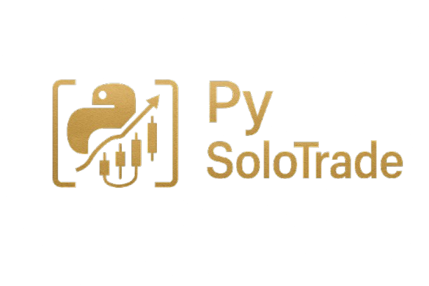

# 🚀 PySoloTrade

<div align="center">
  
  <p><em>A comprehensive Python toolkit for quantitative trading research and implementation</em></p>
</div>

[](https://opensource.org/licenses/MIT)
[](https://www.python.org/downloads/)
[](#)
[](#)
[](https://your-website.com)
[](https://pypi.org/project/pysolotrade)

## 📚 Overview

PySoloTrade is a unified Python toolkit designed for quantitative traders, financial analysts, and researchers. It curates over 200 essential fintech tools, APIs, models, and utilities into one accessible and consistent package. With a well-documented API, PySoloTrade simplifies the development, testing, and deployment of trading strategies. It offers seamless interfaces to market data, trading algorithms, sentiment analysis, portfolio optimization, and more, empowering developers to rapidly build and scale sophisticated financial applications.

### 🔑 Key Features

- **Market Data Access**: Unified interface for multiple data sources (Yahoo Finance, Alpha Vantage, etc.)
- **Technical Analysis**: Comprehensive collection of technical indicators and pattern recognition
- **Backtesting**: Flexible engine for historical strategy testing with detailed performance metrics
- **Visualization**: Interactive charts and dashboards for data exploration and result analysis
- **Portfolio Management**: Tools for position sizing, risk management, and portfolio optimization
- **Machine Learning**: Financial-specific feature engineering and model evaluation utilities
- **Broker Integration**: Standardized interfaces for paper trading and live execution (planned)

## 🚀 Getting Started

### Installation

```bash
pip install pysolotrade
```

### Quick Example

```python
import pysolotrade as pst

# Load historical data
data = pst.data.load_stock("AAPL", start="2020-01-01")

# Calculate technical indicators
data = pst.indicators.add_sma(data, window=20)
data = pst.indicators.add_rsi(data)

# Visualize data
chart = pst.visualize.candlestick(data)
chart.add_indicator(data["sma_20"])
chart.add_indicator(data["rsi"])
chart.show()

# Create and backtest a simple strategy
strategy = pst.strategy.SmaCrossover(short_window=20, long_window=50)
results = pst.backtest.run(data, strategy, initial_capital=10000)

# Display performance metrics
print(results.metrics.summary())
```

### Core Components

- **`pst.data`**: Market data acquisition and management
- **`pst.indicators`**: Technical analysis indicators and patterns
- **`pst.backtest`**: Strategy backtesting and performance analysis
- **`pst.visualize`**: Data visualization and reporting
- **`pst.portfolio`**: Portfolio construction and management
- **`pst.risk`**: Risk assessment and management tools
- **`pst.ml`**: Machine learning utilities for financial data

## 📚 Documentation

Comprehensive documentation is available (in development):

- User Guide (Coming Soon)
- API Reference (Coming Soon)
- Examples & Tutorials (Coming Soon)
- [Development Roadmap](PySoloTrade_Roadmap_DRAFT.md)
- [Tool Inventory](PySoloTrade_Tool_Inventory_DRAFT.md)

## 🛠️ Development Status

PySoloTrade is under active development. See our [ROADMAP.md](docs/ROADMAP.md) for detailed development plans.

Current focus is on building the MVP (Minimum Viable Product) with essential functionality for market data access, technical analysis, and basic backtesting capabilities.

## 🤝 Contributing

Contributions are welcome! Please see [CONTRIBUTING.md](docs/CONTRIBUTING.md) for guidelines on how to contribute to PySoloTrade.

Areas where contributions would be particularly valuable:

- Data source integrations
- Technical indicators and strategy implementations
- Documentation and examples
- Performance optimizations
- Testing across different financial instruments

## 📄 License

PySoloTrade is available under the [MIT License](LICENSE).

## 🙏 Acknowledgements

PySoloTrade builds upon the excellent work of many open-source financial libraries and tools, including:

- [pandas](https://pandas.pydata.org/)
- [NumPy](https://numpy.org/)
- [yfinance](https://github.com/ranaroussi/yfinance)
- [pandas-ta](https://github.com/twopirllc/pandas-ta)
- [Matplotlib](https://matplotlib.org/)
- [Plotly](https://plotly.com/python/)
- [all tools and lib here](./PySoloTrade_Tool_Inventory_DRAFT.md)

## 📬 Contact

- GitHub Issues: [Report bugs or request features](https://github.com/yourusername/pysolotrade/issues)
- Email: solomoneshun373@gmail.com

_**Last updated:** 17th April, 2025_

---

<div align="center">
    <p><em>PySoloTrade: Empowering individual traders with institutional-grade tools</em></p>
</div>
